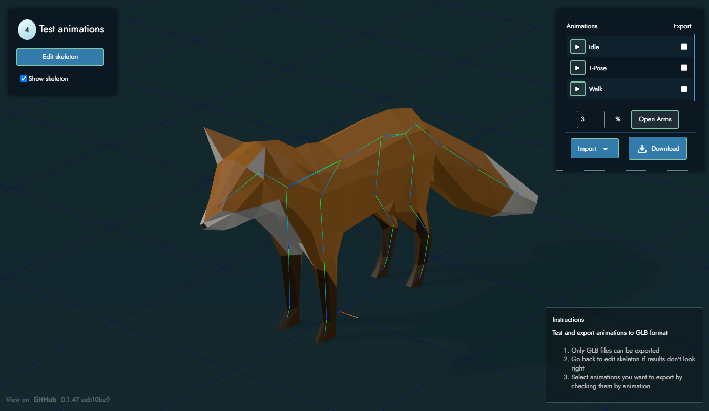

# Mesh2Motion App
Import a 3D Model and automatically assign and export animations. This is kind of similar to a web application like Mixamo, but I would like it to be more flexible so it can support other model types. Hopefully the open source nature means it can be expanded on and evolve more than that tool did. 

Try it live: https://app.mesh2motion.org/

## Usage
There are instructions built into the web application, but this is the general flow of how to use it:
1. Import a 3d model of your choosing (currently only supports GLB/GLTF format)
2. Pick what type of skeleton that the 3d model will use
3. Modify the skeleton to fit inside of the model (optionally test the results)
4. Test out various animations to see the results.
5. Select which animations you want to use, then export (currently only GLB/GLTF supported format)

## Building and running
    npm install
    node run dev

## Creating a production build for the web
We mostly just have typescript for this project, which web browsers cannot just read, so we need to do a build step to get everything ready for deploying. This project uses Vite for the web server and builder. See the vite.config.js for more info. This command will create a "dist" folder with all the files to serve to the web:

    npm run build

## Vision/TODO
These are some ideas and directions I would like to go with this for the future:
1. Better skinning algorithm to support more model types
2. Allow people to make 3d animations using the skeleton templates and and load them into the web application for use.
3. More import and export formats
4. Support for multi-mesh models for skinning

